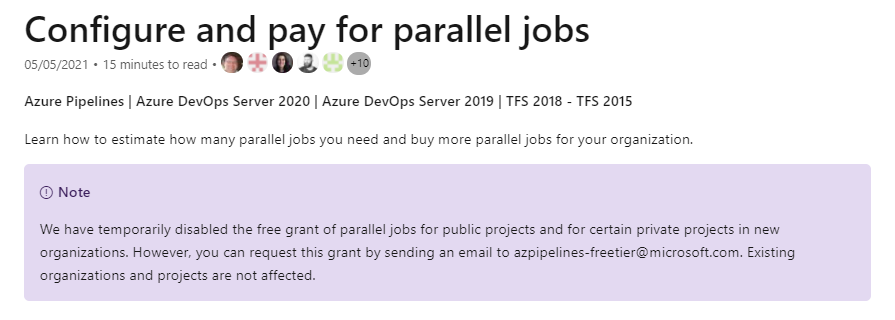
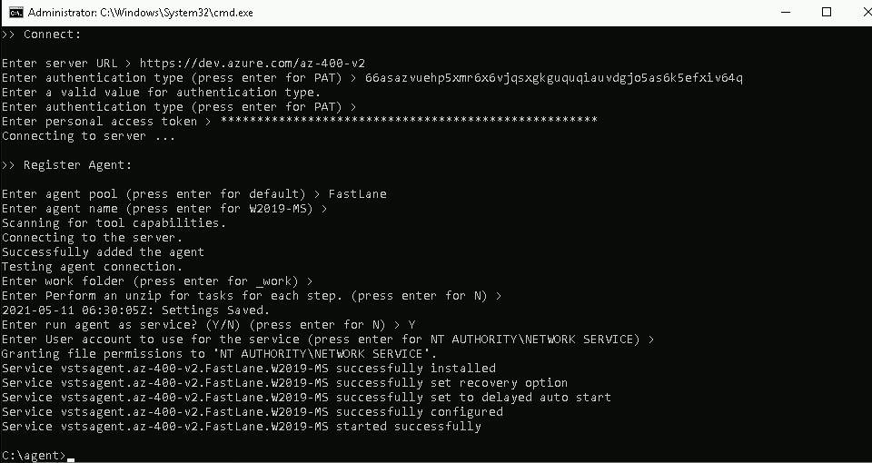

# Continous Integration

## Prerequisites

Because of ressource restrictions in Azure you might have to install a custom build agent.



> Note: Further info can be found [here](https://docs.microsoft.com/en-us/azure/devops/pipelines/licensing/concurrent-jobs?view=azure-devops&tabs=ms-hosted)

Options:

- Ask Microsoft to enable free agents by writing an e-mail to `azpipelines-freetier@microsoft.com` with the following text:

```
I would ask you to enable free jobs for the tenant XY belonging to EMAIL as I am taking an AZ-400 (Azure Devops) training this week
```

- Setup a custom build agent

### Custom Build Agent Setup

Follow the steps described:

- Create a folder and download agent software using a PowerShell prompt

```
mkdir agent ;
cd agent
Add-Type -AssemblyName System.IO.Compression.FileSystem ; [System.IO.Compression.ZipFile]::ExtractToDirectory("$HOME\Downloads\vsts-agent-win-x64-2.182.1.zip", "$PWD")
```

Configure the agent using `config.cmd` from `/agent` folder. A detailed description can be found [here](https://docs.microsoft.com/en-us/azure/devops/pipelines/agents/v2-windows?view=azure-devops)



> Note: Another option would be to use a [Container based agent](https://docs.microsoft.com/en-us/azure/devops/pipelines/agents/docker?view=azure-devops)

## Azure DevOps

[Create a build pipeline with Azure Pipelines](https://docs.microsoft.com/en-us/learn/modules/create-a-build-pipeline/)

[Run quality tests in your build pipeline by using Azure Pipelines](https://docs.microsoft.com/en-us/learn/modules/run-quality-tests-build-pipeline/)

[Manage build dependencies with Azure Artifacts](https://docs.microsoft.com/en-us/learn/modules/manage-build-dependencies/)

[Scan open source components for vulnerabilities and license ratings in Azure Pipelines](https://docs.microsoft.com/en-us/learn/modules/scan-open-source/)

## GitHub Actions

[Build continuous integration (CI) workflows by using GitHub Actions](https://docs.microsoft.com/en-us/learn/modules/github-actions-ci/)
