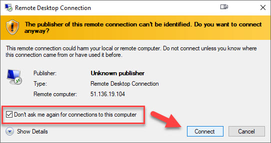
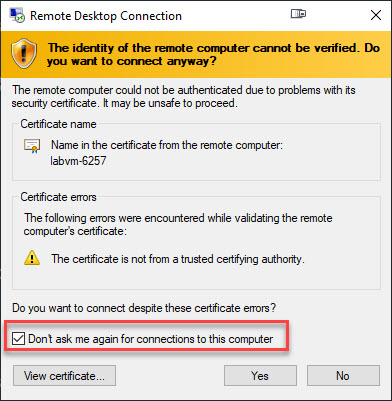
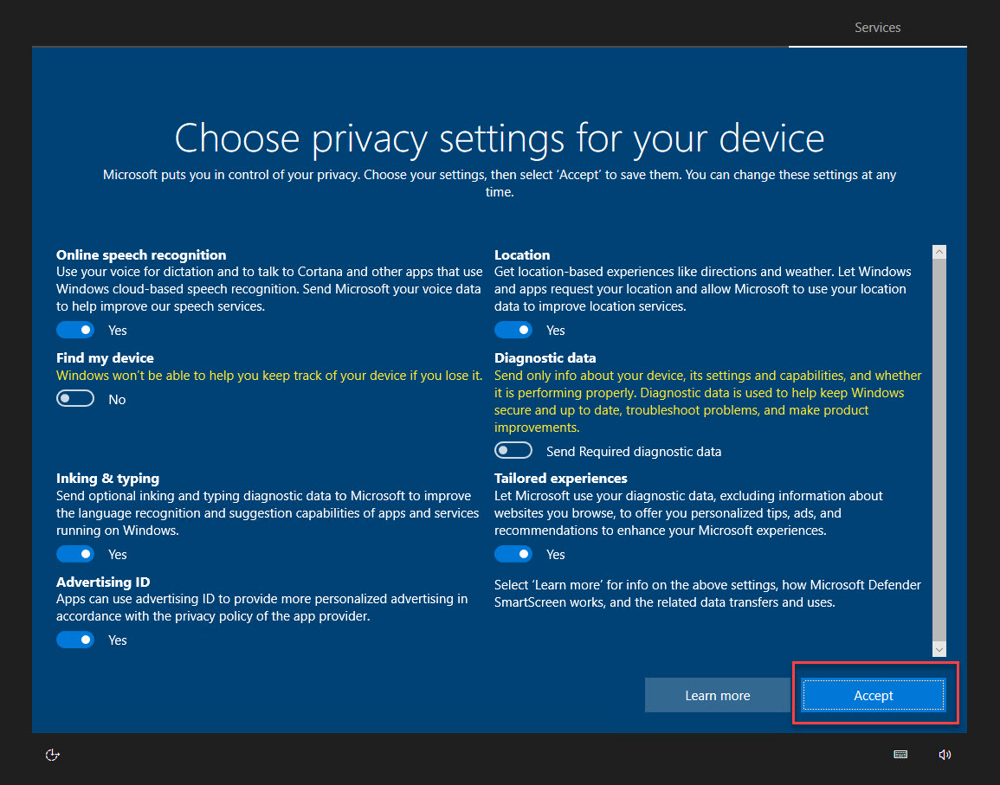
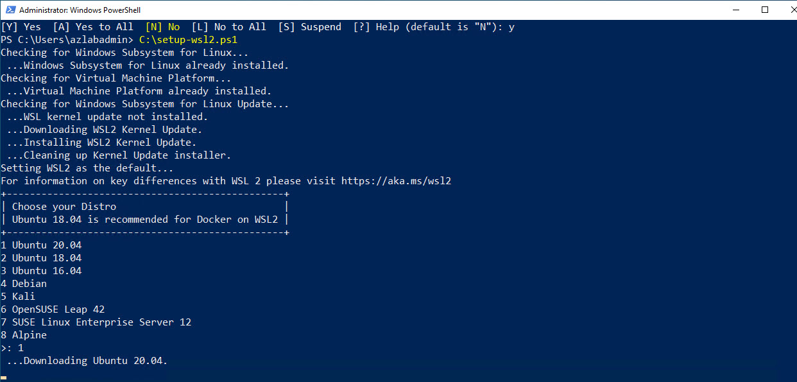
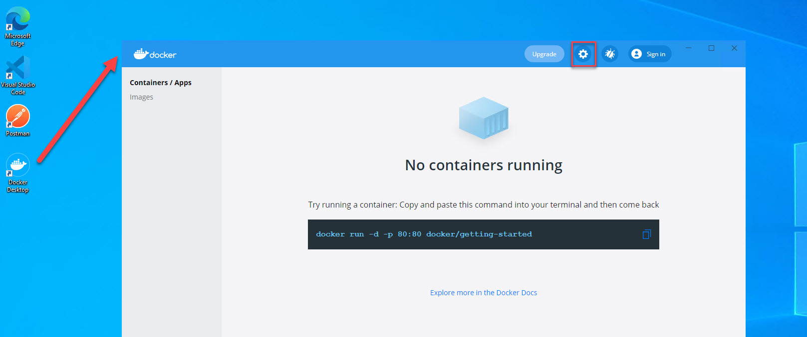
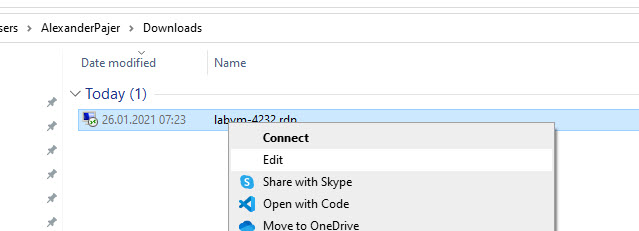
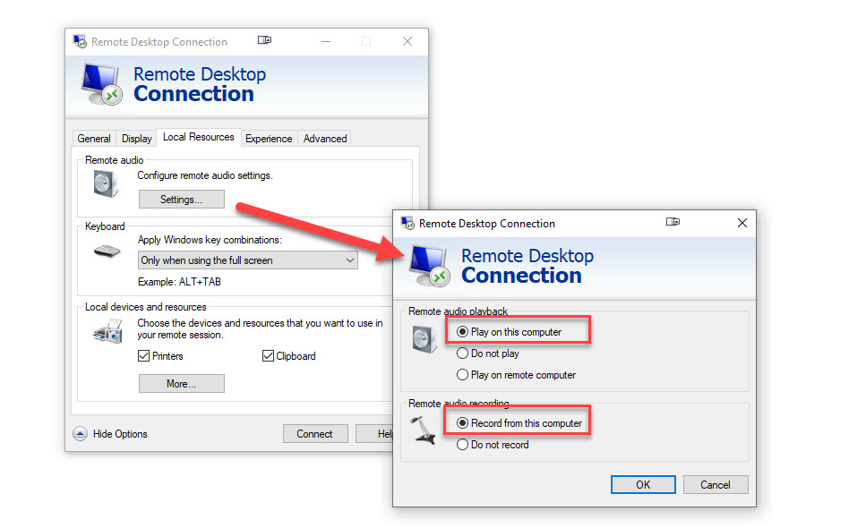
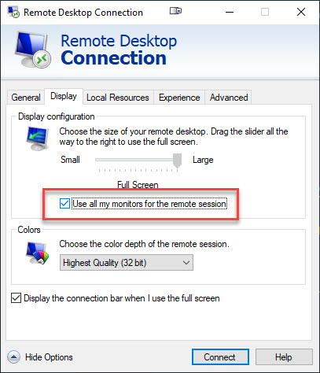

# Lab VM Setup Guide

## Create VM

We are using this image and vm size because it supports nested virtualization used for Hyper-V and WSL2 Support

Script `create-lab-vm.azcli`:

```bash
rnd=$RANDOM
loc=westeurope
grp=az-lab
vmname=labvm-$rnd
user=azlabadmin
pwd=Lab@dmin1233

az group create -n $grp -l $loc

az vm create -g $grp -n $vmname --admin-username $user --admin-password $pwd --image MicrosoftWindowsDesktop:Windows-10:20h2-pron:19042.867.2103051748 --size Stan
```

> Note: If the image needs to be updated or is not available anymore you can list windows 10 images using: `az vm image list -f "Windows-10" --all -o table`

> Note: You could also execute `create-lab-vm.sh` or run the following remote script in Cloud Shell

```bash
curl https://raw.githubusercontent.com/ARambazamba/AZ-400/main/Setup/create-lab-vm.sh | bash
```


> Note: In order for Docker to work on a Windows 10 host you need to install Hyper-V or use Windows Subsystem for Linux 2 (WSL2). A detailed Setup Guide can be found [here](https://github.com/ARambazamba/ClassSetup)

## Connect to VM

Go to Ressource Group `az204-lab` and connect to VM using RDP and the credentials that you have used in the script:

Download RDP File:


Optional - Disable Login:



Sign In & Remember:



Credentials:

```
user=azlabadmin
pwd=Lab@dmin1234
```


Accept Settings:



## Install Software

To install Software run the script `setup-az-400.ps1` from an elevated PowerShell prompt:


```powershell
Set-ExecutionPolicy Bypass -Scope Process -Force;
Invoke-Expression ((New-Object System.Net.WebClient).DownloadString('https://raw.githubusercontent.com/ARambazamba/AZ-400-v2/master/Setup/setup-az-400.ps1'))
```

> Note: This script will run for approx 20 min. No need to wait! In the meantime you can continue to fork and clone my repo as described in the next section.

Congratulations you have completed the base setup of a labs vm!

---

## Fork & Clone Class Repo and set Github requirements

Set User and E-Mail in order to be able to commit to git:

```bash
git config --global user.name "Your Name"
git config --global user.email "your.email@yourdomain.com"
```

Go to `https://github.com/ARambazamba/az-204` and fork the repo


The forking-workflow allows you to commit your changes to your fork of the repo and still get updates on the repo


Clone Class Repo:

```bash
git clone https://github.com/Student01/AZ-400-v2
```

> Note: If you have forked the class repo clone your own fork, otherwise use https://github.com/ARambazamba/AZ-400-v2

---

## Setup Docker Support

There are two options to configure Docker support. WSL2 recommended

### Option 1 - Install Docker with Hyper-V

Install Hyper-V using `setup-docker.ps1` and restart after execution.

Check Docker Settings:


---

### Option 2 - Install Docker with WSL2

#### <a id="wsl">Install WSL2</a>

Execute script `setup-wsl2.ps1` multible times to setup WSL2

```powershell
Set-ExecutionPolicy Bypass -Scope Process -Force;
Invoke-Expression ((New-Object System.Net.WebClient).DownloadString('https://raw.githubusercontent.com/ARambazamba/AZ-400-v2/master/Setup/setup-wsl2.ps1'))
```

First Run:


Second Run:



After the second run your selected linux distro will be opened an you can set your username:

> Note: You can take the same credntials just like on the Windows VM

```
user=azlabadmin
pwd=Lab@dmin1234
```


#### <a id="docker-wsl">Install Docker using WSL2</a>

Install Docker Desktop using an elevated Powershell:

```
choco install docker-desktop -y
```


Log off and on after installation:


> Note: Enter `logoff` in the current console

Start Docker Desktop and switch to settings:



Check the WSL2 settings:


---

### Test Docker Installation

In the console window execute:

```
docker run hello-world
```


## <a id="teams">Optional - Using Teams in VM</a>

To avoid switching between Host an VM you can use Microsoft Teams in the VM and use Audio Redirection

Edit RDP Connection:



Redirect Audio:



Use Secondary Display:



## TODO: Publish Image to Shared Image Galery

[Publish Image to Shared Image Galery](./Create/readme.md)
